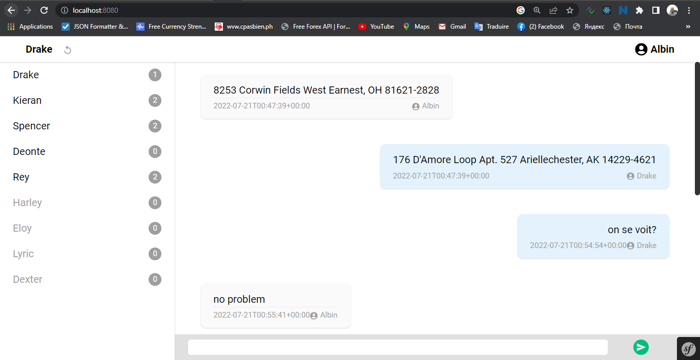

# TEST SYMFONY ET REACT DE NEPHTALI

Le but de ce test est de développer une messagerie instantanée en utilisant une API
GraphQL et React



## TECHNOLOGIES UTILISEES

- Symfony 6.2
- graphql-php 
- Reactjs 18.2
- Tailwindcss 3.2.4
- Webonyx Graphql
- MySQL (5.7)

# DEMARRER L'APPLICATION

- Aller sur la racine du projet:
````
cd kd-chat-test
````
- Installer les dépendances Symfony avec composer:
````
composer install
````
- Installer les dépendances javascript:
````
yarn install
````
- Créer la base des données:   
Je suis sur Mac donc j'utilise le user root et le password root, vous pouvez adapter selon votre système avant de lancer la commande.
````
php bin/console doctrine:database:create
````
- Créer les migrations de la base des données:
````
php bin/console doctrine:migrations:migrate
````
- Génerer les fausses données (fixtures) pour les tests:
````
php bin/console  doctrine:fixtures:load
````
- Installer les assets (pour api-platform et graphql):
````
php bin/console  assets:install
````
- Lancer mercure (nous avons utilisé le binaire pour windows-x86-x64):
````
mercure -d -a localhost:5000 -X -c * --jwt-key "!ChangeMe!" --publisher-jwt-key "!ChangeMe!"
````

-Lancer le serveur:  
S'assurer d'avoir installer symfony-cli (le binaire de symfony inclus dans ce projet est pour windows)
````
symfony serve --port=8000
````

# EXPLORER L'APP

- Le lien de l'application (rassurez-vous que le port est le même que celui du serveur)
````
https://localhost:8000
````

- Le lien de Graphql (verifier que le port est le même que celui du serveur)
````
https://localhost:8000/api/graphql
````

# IDENTIFIANTS DE CONNEXION

On a dit 20 users ayant tous comme mot de passe __azerty__ et des emails du type __user1@gmail.com__ à __user10@gmail.com__

# S'AUTHENTIFIER A L'API

````
curl -X 'POST' \
  'http://localhost:8000/api/login' \
  -H 'accept: application/json' \
  -H 'Content-Type: application/json' \
  -d '{
  "username": "user5@gmail.com",
  "password": "azerty"
}'
````

````
{
  "id": 35,
  "email": "user5@gmail.com",
  "roles": [
    "ROLE_USER"
  ],
  "password": "$2y$13$My.HdVURZEdTvitaEWM3hOi6uP08B/53JCR8nzjS5xI0lJw9XHVGm",
  "apiToken": "000ad4c06afd09f16652cdfa44692f34e5dc2f98",
  "fullName": "Nephtali",
  "userIdentifier": "user5@gmail.com",
  "username": "user5@gmail.com",
  "salt": null
}
````

Utiliser le __apiToken__ dans l'en-tete __X-AUTH-TOKEN__ ou dans le parametre d'url __api_token__ pour s'authentifier sur l'API.